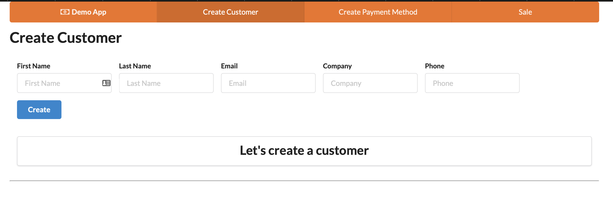
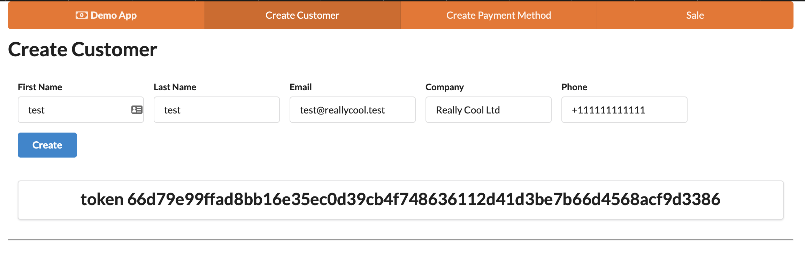
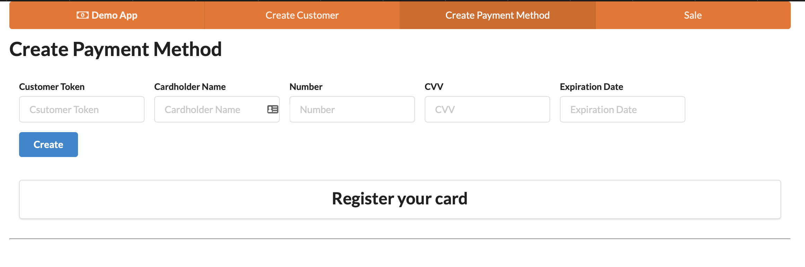
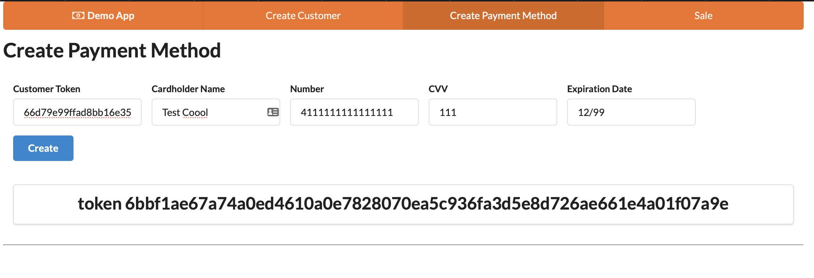
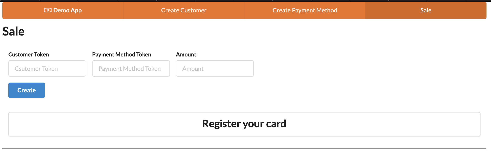
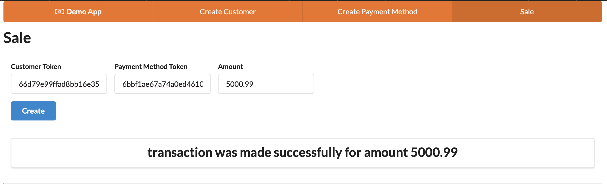

# Primer App

## About
The aim of this application is to provide the backend for processing payments. In this particular
case the only processor I'm going to use is Braintree. This will be purely used as a sample
application.

### Assumptions and understanding of the problem

- This project was developed in a machine using macOS Catalina
- These instructions assume you are working on a unix based system.
- Since the API required is too small, the application will be done with Flask
- Because of `Note: for context, in order for Primer to facilitate recurring transactions across a range of processors, and to centrally capture and store payment information - tokenisation and storage of raw payment information sits with us.`, I've decided to store and manage all customer and payment information in the backend app.
- Even though at the moment the only processor used is Braintree, the current implementation will allow to incorporate other processors in the future, being able to manage multiple of them at the same time.
- We are not the source of truth for the transactions executed. If we need to find out information from it we can pull it directly from the payment processor
- To reduce scope and because there are no explicit requirements, a few things were simplified:
  - PPI data like customer information are store in the DB with the rest of the data.
  - Even though I'm using tokens, I have not introduced any mechanism for expiration of the token (more security)
  - There is no end to end encryption on the communication.
  - Didn't add client documentation to the API (like swagger)
  - You can create a customer through the API, but the functionality is pretty basic. You won't be able to do more things like patching or reading information from the customer.
  - Error messages in the API are really basic. No presenters
  - The only payment method accepted is a credit card. For valid credit card numbers please read the [braintree documentation](https://developers.braintreepayments.com/reference/general/testing/python)
  - Credit cards are not validated. Which means that if is a valid credit card, even though can be declined, will be accepted.
  - There is no authentication, neither authorization on the API, just relies on the tokens.
  - There is no logging
  - There is sample UI in the application to test the backend visually. Do not consider this as production code, since it was created purely for demo purposes.

### Requirements

Make sure that you have the following installed on your machine:

- Braintree account for env variables (https://sandbox.braintreegateway.com/login)
- Python 3.8.5 (version in `.python-version` file)
- I strongly recommend that you setup a virtual environment for this project
- Postgres is used as DB, in case you are using MacOS > 10, make sure that you have the correct openssl flags exported in your terminal, otherwise you will run into trouble with the binaries for `psycopg2`. For example:
```bash
export CPPFLAGS="-I/usr/local/opt/openssl@1.1/include"
export LDFLAGS="-L/usr/local/opt/openssl@1.1/lib"
```
- Docker will be running all dependencies from the project including the DB. For Mac user please read [documentation](https://docs.docker.com/docker-for-mac/)
- Install [npm](https://www.npmjs.com/get-npm) for the demo UI

#### Installing python

You can use your system python, but if you want to use multiple python versions on your machine, use [pyenv](https://github.com/pyenv/pyenv). If you are using it, the python version will be detected automatically inside the project's folder.

#### Installing dependencies

Like I said before, I strongly recommend using a virtual environment for this project, for this run the following:

```bash
make virtualenv
```

Activate the virtual environment
```bash
. venv/bin/activate
```

Install all the dependencies:
```bash
make install
```

If you want to exit the virtual env:
```bash
deactivate
```

#### Postgres

##### Running the DB
Like I mentioned before the DB will be running in a docker container so the application doesn't need to interact with your system. If you have postgres running locally make sure you change the port in the docker container. Here we will assume that you don't need to:

```bash
docker run --name primer_test -e POSTGRES_USER=primer -e POSTGRES_PASSWORD=primer -e POSTGRES_DB=primer_test -p 5434:5432 -d postgres:12.1
```

Also I run 2 different docker container at the same time, one for test and one for development. Make sure all your envs are point accordingly
##### Migrate

```bash
make migrate
```

For rollback:
```bash
make rollback
```

No need to migrate test, all this will be taken care for you automatically.

#### Running tests

Is really important at this point that you have a DB running so you can point the test to. The previous point gives you an example of how to do it. Now you need to set up your testing environment.

##### Setup .test.env

Modify the values accordingly
```bash
cp .sample.env .test.env
```

Once this is done and all env variables are changed to the correct values. Run:
```bash
make test
```

If you have reached this point without errors, congratulations you can start the application.


#### Running the app

Modify the values accordingly
```bash
cp .sample.env .dev.env
```

For running the app:
```bash
python app.py api
```
Anything else will show you an error message.

#### Running the UI

For demoing the backend here is a sample UI included in the project. You can start it by doing
the following:

**Make sure that you have the API up and running before this step**

cd into the directory
```bash
cd sample-ui
```

Install all dependencies:
```bash
npm install
```

Run the app:
```bash
npm start
```

Go to the [UI](http://localhost:3000)

## Demo

The UI application was created to visualise how does the tokens get created and how they are needed to create a payment
method and a sale with any amount. Encryption was not added to make the visualization easier, but in a real app this
would need to be a requirement, since we are dealing with financial information and PII.

The main focus was the backend, so again the UI was created to be dropped and used only for the demo and in a real
scenario it wouldn't even be part of this repo.

The UI is a Single Page App, with 3 tabs one per action you can do in the API. Follow this steps, clicking on the tabs
to complete the demo:

1. **Create a customer**: This will give you back a customer token, which you will use for assigning
a payment method to the customer.

Create customer tab



Customer tab with token



**Save the token !**

2. **Create a payment method**: This will give you back a payment method token, which you will use for generating a sale.
Make sure you use a [valid card](https://developers.braintreepayments.com/reference/general/testing/python#valid-card-numbers), other wise you are going to receive an error.

Create payment method tab



Payment method tab with token



**Save the token !**

3. **Generate a sale**. This is just a sample, but together the customer token with the payment method token you will be able to create a sale for whatever amount you would like.

Create sale tab



Sale with success message



Also whatever you are doing will be reflected in the payment processor. In this case will be braintree.

## Missings

Aside from the things that I removed to reduce scope, also I would add the following things:
- Integrate the token system with an authentication and authorization system. So everything about
it becomes transparent to the user.
- Dockerise the app
- Deployment process ( It could be something like kubernetes )
- Alerting
- Monitoring
